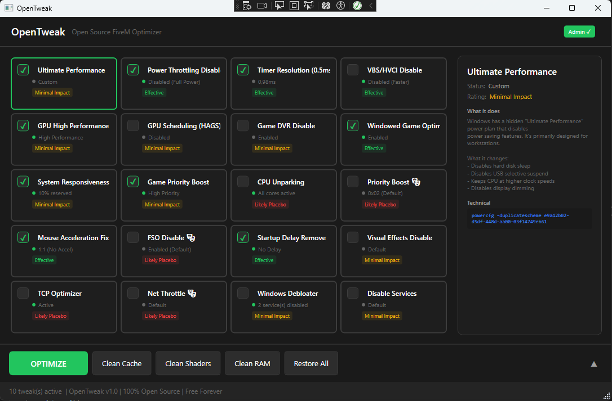

# OpenTweak


**See exactly what "FPS boosters" actually do to your system.**

Commercial optimization tools charge $30-60 for simple Windows tweaks. OpenTweak does the same things - completely transparent, showing you exactly what each tweak does and whether it actually helps.

## Screenshot



## Download

**[⬇️ Download Latest Release](https://github.com/SwisserDev/OpenTweak/releases/latest)**

Requirements:
- Windows 10 or 11
- Run as Administrator (required for registry/service changes)

## Features

Every tweak shows what it actually does, with honest effectiveness ratings.

| Tweak | Category | Impact | What It Does |
|-------|----------|--------|--------------|
| [Timer Resolution](docs/tweaks/timer-resolution.md) | System | ✅ Effective | Sets Windows timer to 0.5ms |
| [Mouse Acceleration Fix](docs/tweaks/mouse-acceleration.md) | Input | ✅ Effective | Removes acceleration for 1:1 input |
| [FiveM Cache Cleaner](docs/tweaks/cache-cleaner.md) | Cleanup | ✅ Effective | Clears cache, crashes, logs |
| [Ultimate Performance](docs/tweaks/power-plan.md) | Power | ⚠️ Minimal | Hidden high-performance power plan |
| [Game DVR Disable](docs/tweaks/game-dvr.md) | Windows | ⚠️ Minimal | Disables Xbox Game Bar |
| [GPU Priority](docs/tweaks/gpu-priority.md) | GPU | ⚠️ Minimal | Forces dedicated GPU for GTA V |
| [FSO Disable](docs/tweaks/fso-disable.md) | System | ⚠️ Minimal | Disables Fullscreen Optimizations |
| [Debloater](docs/tweaks/debloater.md) | System | ⚠️ Minimal | Disables telemetry services |
| [RAM Cleaner](docs/tweaks/ram-cleaner.md) | Memory | ⚠️ Minimal | Clears standby memory |
| [TCP Optimizer](docs/tweaks/network-tcp.md) | Network | ❌ Placebo | Disables Nagle's Algorithm |
| [CPU Unparking](docs/tweaks/cpu-parking.md) | CPU | ❌ Placebo | Prevents core parking |
| [Network Throttling](docs/tweaks/network-throttling.md) | Network | ❌ Placebo | Changes throttling index |
| [Priority Boost](docs/tweaks/priority-boost.md) | CPU | ❌ Placebo | Modifies process scheduling |

**Legend:** ✅ Actually helps | ⚠️ Situational | ❌ Marketing nonsense

→ [Full documentation for all tweaks](docs/tweaks/README.md)

## The Truth About "FPS Boosters"

| What They Claim | Reality |
|-----------------|---------|
| "Doubles your FPS" | These tweaks give 0-5% at best |
| "0.5ms input lag reduction" | Timer resolution ≠ input latency |
| "Syncs with server tick rate" | Client can't control server timing |
| "Optimizes network for gaming" | Games use UDP, TCP tweaks don't help |
| "100% VAC safe" | FiveM doesn't use VAC anyway |

The actual factors for FiveM performance:
- Server quality (scripts, player count)
- Your internet connection
- Hardware specs
- Nothing you can fix with registry edits

## Build from Source

```bash
# Clone
git clone https://github.com/SwisserDev/OpenTweak.git
cd OpenTweak

# Build
dotnet build src/OpenTweak/OpenTweak.csproj -c Release

# Or publish single-file exe
dotnet publish src/OpenTweak/OpenTweak.csproj -c Release -o publish
```

Output: `publish/OpenTweak.exe`

## SmartScreen Warning

The exe isn't code-signed, so Windows SmartScreen may warn you. This is normal for open-source software. Options:
1. Click "More info" → "Run anyway"
2. Build from source yourself

## Project Structure

```
OpenTweak/
├── src/OpenTweak/
│   ├── Services/           # Individual tweak implementations
│   ├── ViewModels/         # MVVM view models
│   ├── Models/             # Data models
│   ├── Helpers/            # Registry, process utilities
│   └── Resources/          # WPF styles and themes
├── docs/tweaks/            # Detailed tweak documentation
└── .github/workflows/      # CI/CD pipelines
```

## Contributing

Found a tweak that should be exposed? PRs welcome.

Guidelines:
- Each tweak needs honest effectiveness rating
- Include technical details (registry keys, commands)
- Explain what it actually does vs. what sellers claim

## License

MIT - Do whatever you want with this code.

---

**OpenTweak** - Because you shouldn't pay $30 for registry edits.
